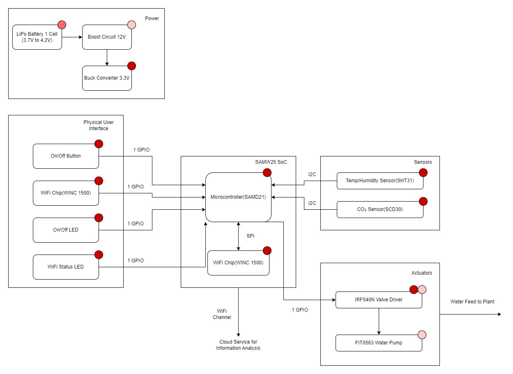

# a14g-final-submission

    * Team Number: 30
    * Team Name: T800
    * Team Members: Jinrong Liu & Gengzhi Zhu
    * Github Repository URL: https://github.com/ese5160/a14g-final-submission-s25-t30-t800
    * Description of test hardware: (development boards, sensors, actuators, laptop + OS, etc), SAMW25 MCU, SCD30 CO2 Senor.

## 1. Video Presentation
[Demo Video](https://youtu.be/xAPIVZoemPU)

## 2. Project Summary
### Device Description
The Smart Greenhouse System is an IoT-enabled environmental control platform that monitors and regulates temperature, humidity, CO₂ levels, and soil moisture to optimize plant growth. It automates irrigation based on real-time sensor data and remote cloud inputs.  

Inspired by the challenges of sustainable agriculture and urban farming, this project aims to solve the problem of manual greenhouse management by introducing autonomous, data-driven decision-making to reduce human effort and improve crop health.  

Our device uses Wi-Fi (via the SAMW25 MCU) to connect to the cloud through MQTT. This enables real-time remote monitoring and control from a Node-RED dashboard, allowing users to view live sensor data and toggle actuators such as LEDs and water pumps over the internet.  

### Device Functionality
This system integrates the following components:  

**Sensors:**  
SHT31: for temperature  
SCD30: for CO₂ concentration  and humidity  

**Actuators:**    
IRLZ34N MOSFET: controls water valve for irrigation  
On-board LED: for status/debug indication  
FIT0563 Water Pump  

**Connectivity:**    
SAMW25 MCU with integrated Wi-Fi  
MQTT protocol for bidirectional communication  
Node-RED dashboard for UI  
Subscribe MQTT node of SCD30 Sensor data upload, FIT0563 Water Pump control, and CLI command  

**System block diagram:**    

### Challenges
**Firmware:**    
Integrating FreeRTOS with I2C driver framework required careful task synchronization using mutexes and callback interrupts to avoid sensor data collisions.  

**Hardware:**    
Both the Buck and Boost converter on the PCBA cannot output correct voltage. We use the benchtop DC power supply instead to power our system.  

**Integration:**    
Ensuring full-duplex MQTT communication between Node-RED and the MCU was challenging—debugging required careful topic structuring and state management.  
### Prototype Learnings
Building this system taught me the importance of modular design in embedded systems. I learned how to debug real-time I2C communication, manage FreeRTOS task timing, and design hardware-software co-optimized systems.  

If I could to rebuild this system, I would:  
Implement a unified sensor abstraction layer in firmware.  
Design a backup power regulator.  
Improve the overall system integrity.   

### Next Steps & Takeaways
**Improvements Planned:**  
Add cloud-based data logging (e.g., via InfluxDB or Firebase)  
Add mobile push notifications for critical alerts (e.g., low soil moisture)  

**Course Takeaways:**  
ESE5160 taught me how to take a complex embedded idea from concept to prototype. I now have hands-on experience in:  
Real-time firmware development using FreeRTOS  
Cloud-MCU communication using MQTT  
Integrated debugging across hardware, firmware, and web UI  

### Project Links
[Node-RED instance Backend](http://172.191.97.168:1880/#flow/tab_greenhouse)  
[Node-RED instance dashboard](http://172.191.97.168:1880/ui/#!/1?socketid=zouAJPODBevSTZA9AAA9)  
[Final PCBA](https://upenn-eselabs.365.altium.com/designs/E5187DEE-6EC9-4D4B-8E06-A8892717EEDD#design)  

## 3. Hardware & Software Requirements
### Hardware Requirements Specification Review
#### HRS 01 – The system shall use a SAMW25 microcontroller with integrated Wi-Fi for real-time data transmission and remote monitoring.  

Review: We have implemented the use of WiFi for monitoring and real-time data transfer, the exact effect of which we have presented in the video presentation  

#### HRS 02 – The system shall be powered by a single Lithium Ion cylindrical cell to enable portable and sustainable operations.  
Review: We realized the use of lithium battery power supply, the lithium battery will be inserted into the J1 port to realize the batter power supply mode
 
#### HRS 03 – The system shall include CO₂, temperature, and humidity sensors in each crop zone. These sensors shall communicate with the microcontroller via I2C and operate within manufacturer-specified accuracy and range limits.  

Review: In the specific project we did not divide the crop area in detail, we measured CO₂, Temperature and Humidity in the same area and completed the I2C communication through the sensors and the MCU, for CO2 and Humidity we did not verify the accuracy but for temperature we measured the ambient temperature using a thermal camera because SCD30 sensor is expensive and its accuracy is very high.  

:
physical drawing of the scd30.  

Figure2 :  
we not only use thermal camera to measure PCB but also use it to measure the ambient temperature to verify the accuracy of the sensor.  

#### HRS 04 – Motors for window adjustment and electromagnetic valves for irrigation shall be incorporated. They shall be physically robust enough to operate in typical greenhouse conditions (temperature, humidity, and dust).   

Review: Our final actuator does not use a motor, only a solenoid valve, which we control to switch on and off according to the ambient humidity level.  

#### HRS 05 – The I2C bus shall be used for sensor data collection to reduce wiring complexity and ensure efficient data transfer rates suitable for real-time control.  

Review: We implemented I2C communication between the SAMW25 microcontroller and the SCD30 environmental sensor. This bus-based configuration significantly reduced wiring complexity by allowing sensor to share the same clock and data lines (SCL and SDA), simplifying the PCB layout and physical integration. The I2C interface reliably supports the data rates required for real-time environmental monitoring (CO₂, temperature, humidity), though the actual sensor polling intervals were adjusted according to power management priorities and application needs.

#### HRS 06 – The motors and valves should be mounted on a stable overhead track to facilitate precise and targeted irrigation without disturbing neighboring crop zones.   

Review: Instead of using overhead tracks, we ended up laser engraving a separate space directly to simulate a greenhouse environment.   

#### HRS 07 – The system shall not require an external power source under normal operating conditions, relying solely on the Li-Ion battery.  

Review: We have not completed this part of the content, the buck circuit because of the manufacturer's reasons we, V_Buck maximum only 2.1V, so we can only use an external power source to provide 3.3V to the PCBA, Boost circuit because of the design reasons, we built-in capacitor size is not enough, the empty-load is able to output 6.6V, but the output voltage is only 6.6V under load conditions. 5.6V under load, it can't load the actuator properly.

#### SRS 01 – Environmental Monitoring: Each sensor module shall measure the concentration of CO2, ambient temperature, and humidity within its designated zone. Measurements of CO2 and temperature shall be taken every 30 seconds +/- 5 seconds; humidity shall be measured every 60 seconds +/- 10 seconds.  
Review: Our measurement speed is much faster than the original design, achieving millisecond measurement and transmission!  
#### SRS 02 – Actuator Control: Based on sensor inputs, the system shall control actuators to adjust environmental conditions. If CO2 levels exceed pre-defined thresholds appropriate for the crops in any zone, ventilation windows shall be opened automatically within 5 seconds of detection. If humidity drops below the set threshold, irrigation shall be activated within 10 seconds.  
Review: Our final result was to achieve an actuator response within 1 second!  
#### SRS 03 – Remote Data Access: The system shall provide real-time environmental data to users via a GUI accessible through standard web browsers. The GUI shall update sensor readings every minute.  
Review:Due to hardware, we had a conflict between tasks that prevented us from displaying the measurement data in real time in the browser access interface. However, we designed the user interface and used a computer to display the data.  
#### SRS 04 – System Configuration and Alerts: Users shall be able to configure threshold values for CO2, temperature, and humidity for each zone through the GUI. The system shall send alerts to the user's registered email or mobile device when any threshold is breached.  
Review: We set up alerts but did not implement sending alerts to email and mobile devices  
#### SRS 05 – Energy Management: The system shall monitor its battery status and notify users when the battery level falls below 20%. It should also enter a low-power mode if no user interaction occurs within a 24-hour period, while maintaining minimum monitoring functionality.  
Review: This part was not implemented due to manufacturing issues with our power supply system  

#### SRS 06 – Log Data: The system shall log all sensor data with timestamps in a local database, accessible to the user for download and analysis. The data shall be stored for at least one year before archival.
Review: We have implemented the display and saving of the data, the user can download the data, but the historical data will be lost with each update

#### SRS 07 – Software Updates: The device shall be capable of receiving firmware updates over-the-air via Wi-Fi, without requiring physical access to the hardware.
Review: We have implemented the use of WIFI for software updates!

## 4. Project Photos & Screenshots
**Final project:**    

**PCBA top view:**    

**PCBA bottom view:**    

**Thermal camera image:**    

**2D Board design top view:**    

**2D Board design bottom view:**    

**3D Board design top view:**    

**3D Board design bottom view:**    

**Node-RED dashboard:**    

**Node-RED backend:**    

**System block diagram:**    

## Codebase

[Link to final embedded C firmware codebases](https://github.com/ese5160/final-project-t30-t800)  
[Link to Node-RED dashboard code](https://github.com/ese5160/final-project-t30-t800/tree/main/Node-RED)

